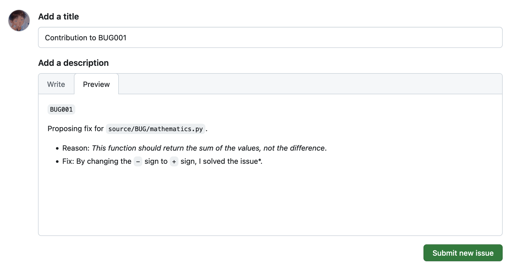
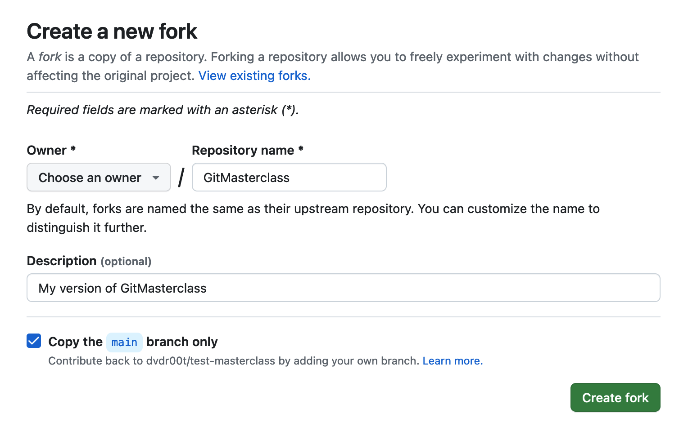
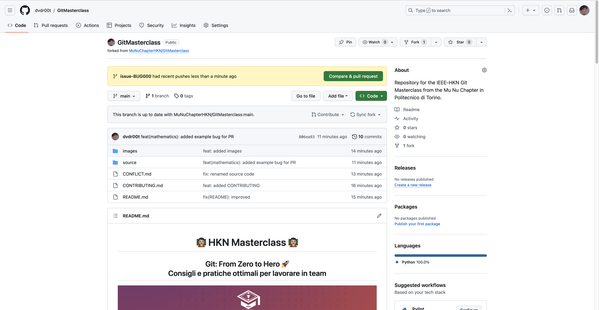
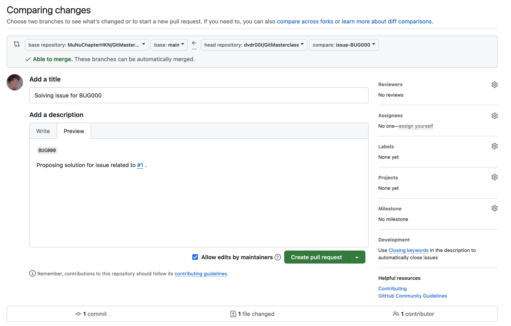
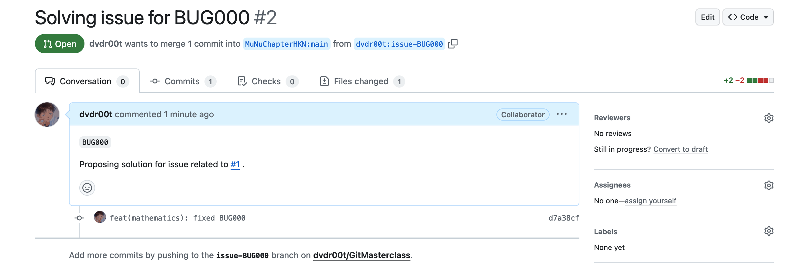

# Git: From Zero to Hero - How to contribute

In the context of Git and open-source code, a **contribution** typically refers to any meaningful addition, modification, or improvement made to a project's source code by a collaborator or contributor. Contributions can take various forms, such as adding new *features*, *fixing bugs*, *optimizing code*, or *enhancing documentation*. These changes are usually submitted through a **version control system** like **Git**, often in the form of **Pull Requests** (**PR**). The collaborative nature of open source encourages developers from diverse backgrounds to share their expertise and collectively advance the quality and functionality of a project through their contributions. Effective collaboration and the transparent tracking of contributions are essential aspects of the open-source development model, allowing for community-driven innovation and continuous improvement.

> [!TIP]
> A **contribution** in open-source development refers to any valuable addition or modification made by collaborators to a project's source code, fostering collective improvement and innovation.

## Table of Contents

- [Git: From Zero to Hero - How to contribute](#git-from-zero-to-hero---how-to-contribute)
  - [Table of Contents](#table-of-contents)
  - [Getting Started](#getting-started)
    - [What maintainers ask for](#what-maintainers-ask-for)
  - [Realistic scenarios](#realistic-scenarios)
    - [Every project is different](#every-project-is-different)
    - [Some links to famous open-source projects](#some-links-to-famous-open-source-projects)
  - [How to contribute to this Masterclass](#how-to-contribute-to-this-masterclass)
    - [Explore the code](#explore-the-code)
    - [Open a new Issue](#open-a-new-issue)
    - [Get a copy of the project](#get-a-copy-of-the-project)
      - [Fork the repository](#fork-the-repository)
      - [Clone your repository](#clone-your-repository)
    - [Fix and commit your code](#fix-and-commit-your-code)
      - [Create a new branch](#create-a-new-branch)
      - [Push the changes to the remote](#push-the-changes-to-the-remote)
    - [Open a Pull Request (PR)](#open-a-pull-request-pr)
    - [Conclusions](#conclusions)


## Getting Started

Contributing to an open-source project is a matter of precision, knowledge and time. The source code you want to modify is potentially used by hundreds, or even millions of people. Therefore, you should be careful when proceeding in each step.

> [!CAUTION]
> If in doubt, read. If in doubt again, ask us. Don't do any operation that you are not sure of. Don't change code you are not require to change.

### What maintainers ask for

Typically, you will have knowledge on the following operations:

- Where and how to report bugs.
- Where and how to request for new features.
- Where and how to ask for contributions on the documentation.
- And more.

In this workshop, you can find every details in the document you are just reading. Please, read it carefully.

## Realistic scenarios

Contributing to real open-source projects is a process that requires time and attention. In this section, we will try to explain you why. Keep in mind that, during this workshop, you will not propose code changes that people will actually use for their business. This workshop should allow you to test and try the process of contribution. In this scenario, and also in real-case scenarios, **you are allowed to make mistakes**! However, mistakes should definitely not come from **lack of reading**. Maintainers of open-source projects spend hours and hours in writing documentation and guidelines in order to allow a smooth flow on your part. Make sure to read and understand what you are asked about before proposing code changes.

### Every project is different

Every open-source project has its own team of developers, testers, releasers, maintainers and, of course, contributors. As people work differently (why not?), they usually make sure to carefully explain **how to work with them**.

It is common, in open-source repositories, to find files that are specifically dedicated to report guidelines, tips and common scenarios regarding the contribution. Below is a short list (definitely not comprehensive) of those files:

- `README.md`. Hopefully, this is the first file you look up when you find a new repository. As the name suggest, you should carefully read this file and you should have definitely  read this first. The `README` often contains a section on contributing. It outlines the process, expectations, and steps for contributing to the project.
- `CONTRIBUTING.md`. Some projects (as this workshop) have a dedicated file named `CONTRIBUTING`. This file goes into more detail about how contributions should be made, the coding standards to follow, and any specific guidelines for submitting changes. You are reading it now! Well, in real-case scenarios, this file will typically go straight to the point. Therefore, if you already know what contributions are, skip to [How to contribute to this Masterclass](#how-to-contribute-to-this-masterclass).
- `CODE_OF_CONDUCT.md` and `COMMUNITY_PLEDGE.md`. These files may not explicitly describe how to contribute, but they often outline the expected behavior of contributors and set the tone for the project's community.
- `LICENSE`. While not a guide for contributing, the license file is important for understanding how the code can be used, modified, and distributed. It's a crucial part of contributing to an open-source project.

In addition to that, maintainers may have ad-hoc non-standardized files in the repository (like we do! check out [CONFLICT.md](./CONFLICT.md) to complete the second part of this workshop) or file related to similar aspect that contributors should be aware of. Examples are:

- `DEVELOPERS.md`. It typically provides additional information specifically targeted at developers who want to contribute or understand more about the technical aspects of the project. It may contains details on how to run or test the project.
- `SECURITY.md`. It outlines the procedures for responsibly reporting and addressing security vulnerabilities, ensuring a secure and collaborative environment for contributors and users.
- `CHANGELOG.md`. It provides a chronological record of notable changes made to the project, offering a transparent overview of version updates, new features, bug fixes, and improvements.
- `UPGRADE.md`. It serves as a guide for users and developers, detailing essential information and steps required when upgrading to new versions of the project. It ensures a smooth transition by providing insights into compatibility changes, deprecated features, and any necessary adjustments for a seamless upgrade experience.

And yet, there may be more.

> [!IMPORTANT]
> Every open-source project is different. Always read and adhere to its own guidelines!

### Some links to famous open-source projects

The following table contains links to real open-source projects, alongside the link to the file or website to which developers must refer to in order to contribute to it.

| **Project** | **Description** | **How to Contribute** |
|:--:|:--:|:--:|
| [**Kubernetes**](https://github.com/kubernetes/kubernetes) | Kubernetes is a container orchestration platform that automates the deployment, scaling, and management of containerized applications. | [README.md](https://github.com/kubernetes/community/blob/master/contributors/guide/README.md) |
| [**Kong**](https://github.com/Kong/kong/) | Kong is an open-source API gateway and microservices management platform. | [CONTRIBUTING.md](https://github.com/Kong/kong/blob/master/CONTRIBUTING.md) |


## How to contribute to this Masterclass

This may be your first time contributing to an open-source projects or you may have already experienced the process on your own. For this reason, we have prepared a guided hand-on workshop that (hopefully!) will help you get comfortable with the process, by understanding how to manage the most used features of Git and GitHub. 

> [!TIP]
> This guide is intended as a go-to if you ever feel lost during this workshop. However, keep in mind that we (as HKN tutors) will be there to help you, if ever in need.

Without further ado, let's get started.

### Explore the code

You may have notice that the code we propose in this workshop, does not actually provide anything useful to the real world. However, people usually make money out of the code you will be reading. Therefore, it is important that you get comfortable in reading the code you want to contribute to. 

> [!IMPORTANT]
> Always understand what the code is doing and what it is supposed to do.

Feel free to explore the code in this repository. We have provided a [`source`](./source/) repository that is the entry-point to the code you need to contribute to. Inside, we have divided the code into two directories:

- [`BUG`](./source/BUG/). This folder contains, with no surprise, bugs! Everything is written in Python, as hopefully you have already completed the course of Computer Science in the first year at Politecnico di Torino. Don't worry. It does not require any specific knowledge of Python. Simple understandings of the language is ok. Inside, you will find five different Python files, each containing specific bugs, for a total of 100:
  - [`mathematics.py`](./source/BUG/mathematics.py) contains bugs related to mathematical operations, such as trigonometry or arithmetic operations.
  - [`logic.py`](./source/BUG/logic.py) contains bugs related to logical thinking and rules, such as boolean operations or paradoxes.
  - [`strings.py`](./source/BUG/strings.py) contains bugs related to strings operations, such as counting characters or reversing a string.
  - [`structures.py`](./source/BUG/structures.py) contains bugs related to data structures, such as lists and dictionaries.
  - [`forExperts.py`](./source/BUG/forExperts.py) contains algorithms! This is the only file that should be challenging for you.
- [`FAQ`](./source/FAQ/). This folders contains 100 questions. Everything is written in plain english and you are supposed to simply write the answer of the question as a contribution. You'll find questions related to [Git](./source/FAQ/Part1.md), [programming](./source/FAQ/Part2.md) in general, [Politecnico di Torino](./source/FAQ/Part3.md), [history of computer science](./source/FAQ/Part4.md) and some [miscellaneous](./source/FAQ/Part5.md).

The core idea is that `BUG` should resemble contributions to source code, as in real-case scenario you must know how to code to contribute, while `FAQ` should resemble contributions to the documentation, as you should know how to write plain and clear english.

Each bug and FAQ is defined by a specific alphanumeric code, which is written right next to the function or the question, such as:

```python
def add_values(a: int, b: int) -> int: 
    '''
    BUG001: add_values should return the sum of the values, not the difference.
    '''
    result = a - b
    return result
```

When you open a Issue, you should refer to the bug using this alphanumeric code. `BUG001` refers to the bug in the `add_value` function, while `FAQ001` refers to the first question in the FAQs.

> [!CAUTION]
> Contributing to the code is a matter of precision. Opened issues and PRs that fail to refer to the correct bug, will be discarded.

### Open a new Issue

To speed up the process, you should have received two post-its containing those alphanumeric code, one referring to a `BUGxxx` and one referring to a `FAQxxx`. Those are the contributions you should make. However, feel free to explore the code on your own and propose other changes.

First thing you should do now is to **open a new issue**. Navigate to `https://github.com/MuNuChapterHKN/GitMasterclass/issues` and click the green `New issue` button on the top right of the screen. You will be asked to add a **Title** and a **description** of the issue. We require you to follow the below guidelines to open a new issue:

- **Title**. The title of the issue should be `Contribution to <ALPHANUMERICCODE>`. For instance, if you want to contribute to fix the first bug, the title of your issue should be: `Contribution to BUG001`.
- **Description**. You should provide the following details:
  - Alphanumeric code of the fix (e.g. `FAQ045`).
  - Name and path of the file in which the fix is proposed (e.g. `source/FAQ/Part1.md`).
  - Reason for the fix (e.g. *This function should return the sum of the values, not the difference*).
  - Proposed changes (e.g. *By changing the `-` sign to `+` sign, I think I can solve the issue*).

Below is an example of a correct opened issue:



Opened issue that are not clear, of differ to much from this template, will be discarded.

> [!CAUTION]
> We are strict, we know. But we did on purpose. When you contribute to real projects, your issues will be discarded if they do not adhere to the code of conduct or they are not clear.  

### Get a copy of the project

If you opened the issue correctly, you will be assigned to the issue. Yeah! You can now work on the code. Wait. No. You first need a copy of the repository to make changes. You cannot make changes directly to the original source-code.

#### Fork the repository

First thing to do is to fork the repository. This operation will create a copy of it in your GitHub profile. You are free to work on your copy as you want, the copy is entirely yours. However, keep in mind that you need to propose the changes you do to your copy to the original repository. 

To fork a repository, navigate to `https://github.com/MuNuChapterHKN/GitMasterclass/`. You will see a `fork` button on the top-right of the screen. Click it, and you will be redirected to a page in which you can choose the name of the fork. 



> [!WARNING]
> Copy only the `main` branch. Make sure that the corresponding box is selected.

#### Clone your repository

Now that you have a copy of the repository, clone it into your local workspace. Open a terminal and type:

```bash
git clone `https://github.com/MuNuChapterHKN/GitMasterclass/`
```

You should see something like:

```txt
Cloning into 'GitMasterclass'...
Username for 'https://github.com': davidearcolini.dev@gmail.com
Password for 'https://davidearcolini.dev@gmail.com@github.com':
remote: Enumerating objects: 21, done.
remote: Counting objects: 100% (21/21), done.
remote: Compressing objects: 100% (18/18), done.
Receiving objects: 100% (21/21), 10.64 KiB | 5.32 MiB/s, done.
Resolving deltas: 100% (1/1), done.
remote: Total 21 (delta 1), reused 21 (delta 1), pack-reused 0
```

You can now `cd` into the folder or open it with your favorite editor (should be Neovim, but Visual Studio Code or similar are fine too... Just kidding 😄).

> [!TIP]
> Now you have a local working copy that is linked to your remote repository (the one you forked). Use the tools we explained in the theoretical part of the Masterclass to commit and push changes to your remote.

### Fix and commit your code

Bugs are defined in each file using the following structure:

```python
def add_values(a: int, b: int) -> int: 
    '''
    BUG001: add_values should return the sum of the values, not the difference.
    '''
    result = a - b
    return result
```

Each function represent a bug. Each file contains 20 bugged functions. Each file has an additional function, called `test()` that tests every other functions is the file. This helps you in understanding if you have fixed the bug or not. Running the file will result in:

```txt
BUG001: RETRY
BUG002: RETRY
[...]
BUG019: RETRY
BUG020: RETRY
```

If you fix a bug and run again the file, you should see the corresponding output indicating the you solved it successfully:

```txt
BUG001: SOLVED SUCCESSFULLY
BUG002: RETRY
[...]
BUG019: RETRY
BUG020: RETRY
```

#### Create a new branch

To fix a bug, is important that you do not change the `main` branch. As we explained in the theoretical part of this Masterclass, you should create a **feature-branch** in which you propose the code changes. Also, it is important that your branch has a valuable name. Use the alphanumeric code of the fix appended to the `issue-` prefix. 


To do so, run:

```bash
git checkout -b issue-BUG001
```

You should see: `Switched to a new branch 'issue-BUG001'`. At this point, you can work on the code changes.

Once the code is fixed, it is time to commit and push the code. Suppose that you changed the code in:

```python
def add_values(a: int, b: int) -> int: 
    '''
    BUG001: add_values should return the sum of the values, not the difference.
    '''
    result = a + b   # <--- change occurred here
    return result
```

When you run `git status`, you will see:

```txt
On branch issue-BUG001
Changes not staged for commit:
  (use "git add <file>..." to update what will be committed)
  (use "git restore <file>..." to discard changes in working directory)
	modified:   source/BUG/mathematics.py

no changes added to commit (use "git add" and/or "git commit -a")
```

Indicating that you have modified a file (`source/BUG/mathematics.py`) that has not already staged for commit. Also, running `git diff source/BUG/mathematics.py` will show and confirm your changes:

```txt
diff --git a/source/BUG/mathematics.py b/source/BUG/mathematics.py
index ed553fc..302a8fd 100644
--- a/source/BUG/mathematics.py
+++ b/source/BUG/mathematics.py
@@ -4,7 +4,7 @@ def add_values(a: int, b: int) -> int:
     '''
     BUG001: add_values should return the sum of the values, not the difference.
     '''
-    result = a - b
+    result = a + b
     return result
```

#### Push the changes to the remote

Now that you have fixed the code, you must push it to your remote repository in order to open a Pull Request.

Run `git add <file-path>` to add to the staging area the file you just fixed. Now, `git status` should return:

```txt
On branch issue-BUG001
Changes to be committed:
  (use "git restore --staged <file>..." to unstage)
	modified:   source/BUG/mathematics.py
```

Now, commit you code using significant message.

> [!CAUTION]
> When committing, you should adhere to the conventional ruled adopted by the maintainer. [**Here**](https://www.conventionalcommits.org/en/v1.0.0/) is an example of common rules. We decided to use the same format, so for instance, if you want to propose a change for a mathematical bug, commit your fix using this format message: `fix(mathematics): solved BUG001`.

```
git commit -m "fix(mathematics): solved BUG001"
```

You can now push the changes to the remote. This will also push the branch you just created:

```bash
git push origin issue-BUG001
```

### Open a Pull Request (PR)

Now, the moment has come. You need to propose you changes to the maintainers! Hopefully, you have written good code and maintainers will approve you changes, allowing you to contribute to the central repository.

Navigate to your forked repository on GitHub. You should see that a pop-up button appears at the top of the screen, suggesting to open a Pull Request to the original repository.



Click on it, and you will be redirect to a new page in which you can review you proposal, add a title and a description for the PR.



Once again, we ask you to strictly adhere to our code of conduct. Specifically:

- **Title** should be in the format: `Solving issue for BUG000`, where you refer to the specific alphanumeric code of your fix.
- **Description** is a crucial part. You want **to link the Pull Request (PR) to the corresponding issue**. In this way, if the PR is merged in the source code, the relative issue will be **automatically closed**. To do so, in the description, you can type: `Proposing solution for issue related to #`. When you type `#`, a menu will appear, allowing you to select the corresponding issue. Choose carefully. 

> [!CAUTION]
> Pull Requests that fail to link the corresponding issue will be rejected.

### Conclusions

Now that you have opened you PR, you should see something like:



You Pull Request is currently in an `open` state, waiting for review by the maintainers (us). If we think that your proposed solution is correct, we will accept the PR and you will have made your **first contribution to an open-source project**!

> [!TIP]
> At this point, repeat the process. If you complete two PRs, you will be awarded the [**Pull Shark achievement**](https://github.com/orgs/community/discussions/20357).